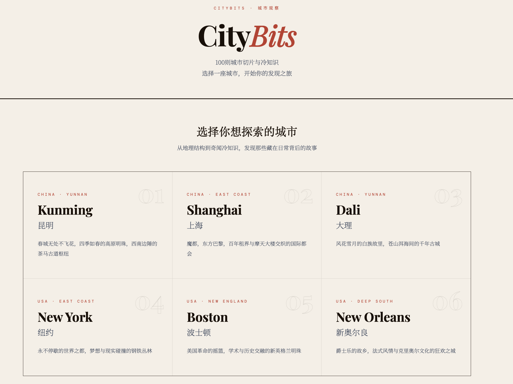
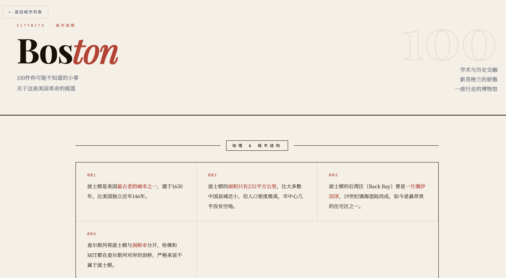
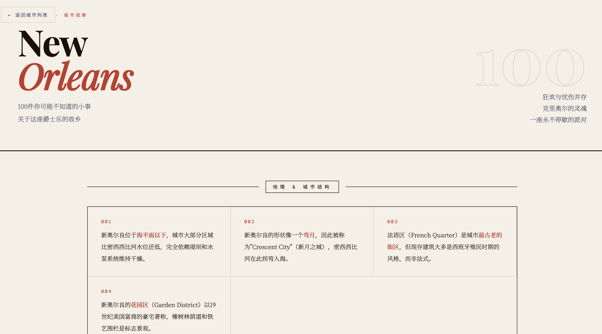

# Web01-CityBit

Status: shipped

CityBits is a static editorial-style website that packages city observations into fast, visual reading. The current build includes 10 city pages with 100 facts each.

## Screenshots

### Landing Page


### City Pages
| | |
|---|---|
|  |  |
|  |  |
|  |  |

## What is included

- 1 landing page for city selection
- 10 city detail pages: Kunming, Dali, Shanghai, Boston, New York, New Orleans, Shenyang, San Francisco, San Diego, Vancouver
- Editorial visual system inspired by newspaper and magazine layouts
- Static deployment setup for Vercel

## Stack

- HTML
- CSS
- Vercel static hosting

## Local preview

Because this is a plain static site, you can open `index.html` directly in a browser or serve it locally:

```bash
cd Web01-CityBit
python3 -m http.server 8000
```

Then visit `http://localhost:8000`.

## Project structure

```text
Web01-CityBit/
├── index.html
├── cities/
│   ├── boston.html
│   ├── dali.html
│   ├── kunming.html
│   ├── neworleans.html
│   ├── newyork.html
│   ├── sandiego.html
│   ├── sanfrancisco.html
│   ├── shanghai.html
│   ├── shenyang.html
│   └── vancouver.html
├── PROJECT_PROGRESS.md
└── vercel.json
```

## Suggested GitHub metadata

- Repository name: `WEB01-citybit`
- Description: `Editorial-style static site with 10 cities and 100 observations each.`
- Topics: `vibe-coding`, `editorial-design`, `static-site`, `city-guide`, `html`, `css`
- Homepage: your deployed Vercel URL

## Publish checklist

- Add a repository description and topics on GitHub
- Set the Vercel deployment URL as the homepage
- Pin this repo on your profile if you want it to represent your work
- ~~Add 1-2 screenshots to the repository~~ Done
